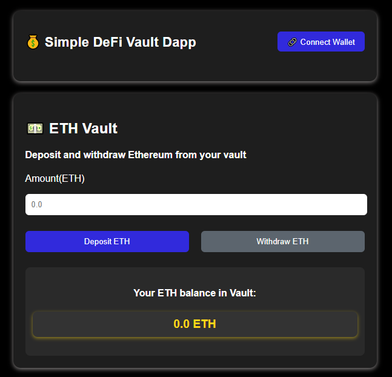
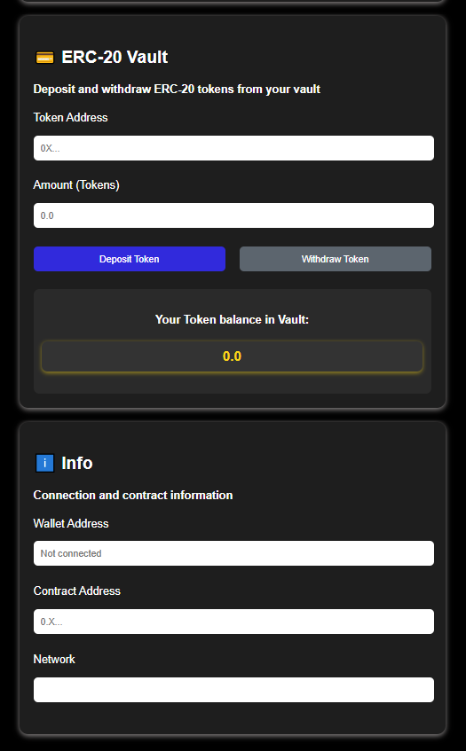

# 💰 Simple DeFi Vault Dapp

A simple decentralized application (dApp) that allows users to:

- Deposit and withdraw **ETH** into a Vault (with simulated interest).
- Deposit and withdraw **ERC-20 tokens**.
- Check balances directly from the interface.

---

## 🚀 Features

- **ETH Vault**

  - Deposit ETH into the smart contract.
  - Withdraw ETH with simulated accrued interest.
  - View stored ETH balance.

- **ERC-20 Vault**

  - Deposit ERC-20 tokens (e.g., MockDAI).
  - Withdraw ERC-20 tokens.
  - View stored token balance.

- **Info Panel**
  - See connected wallet address.
  - See deployed Vault contract address.
  - Check current network (e.g., Sepolia Testnet).

---

## 📸 Screenshots

### Wallet and ETH box



### Tokens + Contract Information



## 🛠️ Tech Stack

- **Frontend**: HTML, CSS, JavaScript
- **Blockchain**: Solidity, Ethereum Testnet (Sepolia)
- **Libraries**:
  - [Ethers.js](https://docs.ethers.org/)
  - [OpenZeppelin Contracts](https://openzeppelin.com/contracts/)

---

## 📦 Installation & Usage

1. Clone the repository:

   ```bash
   git clone https://github.com/tiagogalvao7/vault-defi-dapp.git
   cd vault-defi-dapp´
   ```

2. Install dependencies for smart contracts:

   ```bash
   npm install
   ```

3. Deploy contracts (using Hardhat or Remix):

- `Vault.sol`
- `MockDAI.sol`

4. Copy the Vault contract address into app.js:

   ```bash
    const contractAddress = "0xYOUR_CONTRACT_ADDRESS";
    const contractABI = [ ... ];
   ```

5. Open `index.html` in your browser.
   Connect your wallet (MetaMask) and start interacting 🚀.

---

## 🧪 Testnet Tokens

For testing ERC-20 deposits:

- Deploy the `MockDAI` contract to Sepolia Testnet.
- Mint tokens to your wallet.
- Use the `MockDAI` contract address in the frontend input.
